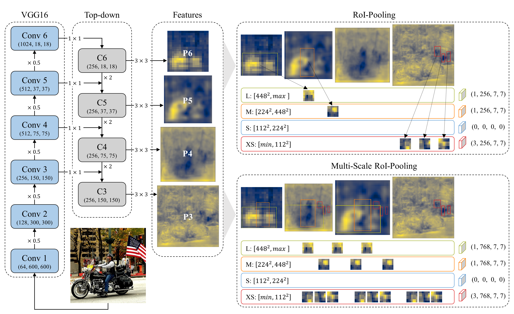
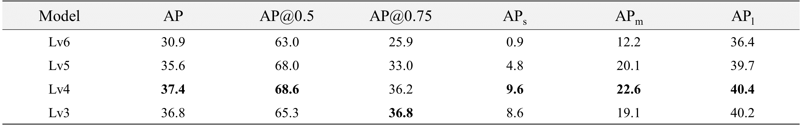

# Improvement of object detector using multi-scale RoI pooling and feature pyramid network

## Abstract

Feature Pyramid Network (FPN) enhances localization accuracy and detection performance on small objects by using multiple scales of features. FPN adopts lateral connections and a top-down pathway to make low-level features semantically more meaningful; however it uses only single-scale features to pool regions of interest (RoIs) when detecting objects. In this paper, we show that single-scale RoI pooling may not be the best solution for accurate localization and propose multi-scale RoI pooling to improve the minor drawbacks of FPN. The proposed method pools RoIs from three levels of features and concatenates the pooled features to detect objects. Thus, FPN with multi-scale RoI pooling, called FPN+, detects objects by taking account of all information scattered across three levels of features. FPN+ improved FPN by 2.81 and 1.1 points in COCO-style average precision (AP) when tested on PASCAL VOC 2007 test and COCO 2017 validation datasets, respectively.

## Overall architecture

Fig. 1 Overall architecture of FPN and FPN+. FPN uses four different scales of features to generate region proposals, but it uses only single-scale features to pool regions of interest (RoIs) when detecting objects. As shown in the upper right of Fig. 1, the large-sized RoIs are pooled from the small-scale features, while the small-sized RoIs are pooled from the large-scale features. FPN+, an improved FPN with multi-scale RoI pooling, uses three different levels of features to detect objects. As shown in the lower right of Fig. 1, each RoI is pooled from three different levels of features and the pooled features are concatenated as a single feature block. 

## Experimental results

### 1. Detection results

Table 1. Performance on VOC 2007 test and COCO 2017 trainval datasets. FPN+ scores the highest in all detection metrics except AP(s) when tested on VOC 2007 test dataset. Training the models on COCO 2017 train dataset gives similar results. FPN+ surpasses FPN in all detection metrics.

### 2. Grad-CAM of FPN and FPN+

Fig. 2 Grad-CAM of FPN (the first row) and FPN+ (the second row).  Grad-CAM shows which part of feature maps contribute the most to detect objects. FPN+ allows more levels of features to contribute to large-sized object detection.

### 3. FPN+ detection examples

Fig. 3 Examples of detection results on PASCAL VOC 2007 test data using FPN+. The model was trained on VOC 2007, 2012 trainval datasets combined, and a score thresh was 0.6.